theme: Simple, 1

 
# Technical debt, technical health &
# systems thinking

 

### Declan Whelan, Leanintuit

^ I know a little about technical debt
^ 40 years
^ EE
^ 10 years of agile
^ Thanks
^ joy
^ fist to 5

---

# Technical Debt Initiative

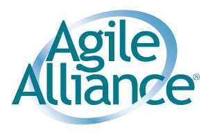

---

# Technical Debt Initiative

* A2DAM model
* Papers on technical debt
* Dice of debt game

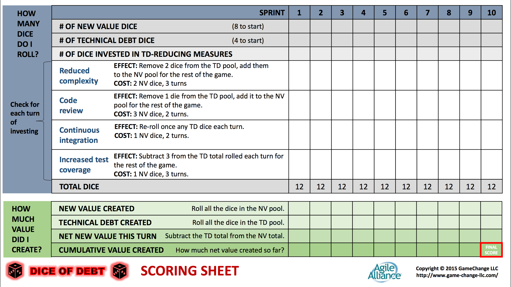

---

> Shipping first time code is like going into debt. A little debt speeds development so long as it is paid back promptly with a rewrite...
-- Ward Cunningham

^ You are borrowing from a future you.

---

>The danger occurs when the debt is not repaid. Every minute spent on not-quite-right code counts as interest on that debt.
-- Ward Cunningham

^ Thanks Ward!

^ The term refactoring was not in common use at the time

^ Ward intended technical debt as a strategy ... not a condition

---

<!--
---

> ...if we failed to make our program align with what we then understood ... then we were gonna continually stumble over that disagreement and that would slow us down
-- Ward Cunningham

^ This is often missed - and how would you measure that anyway?

-->

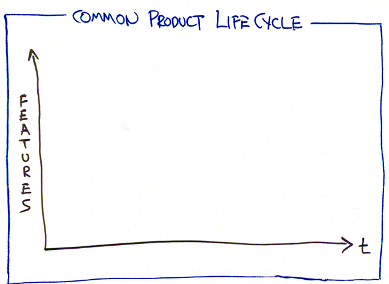

---

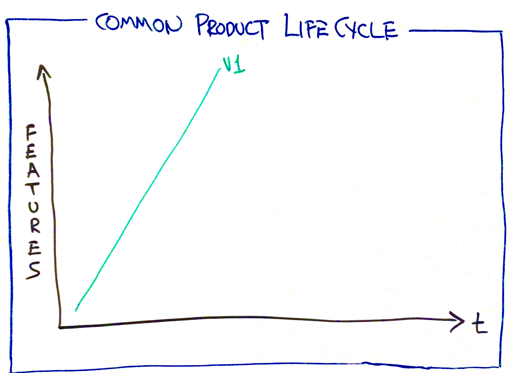

---

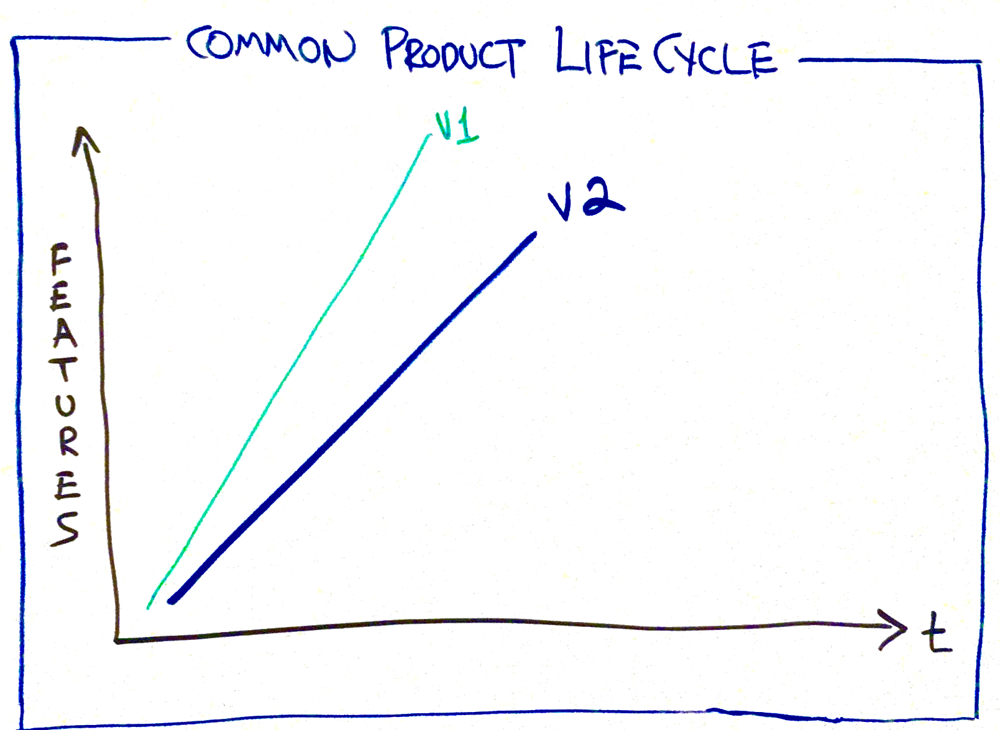

---

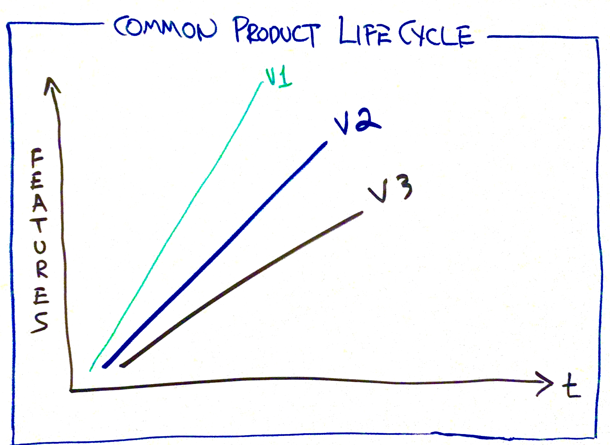

---

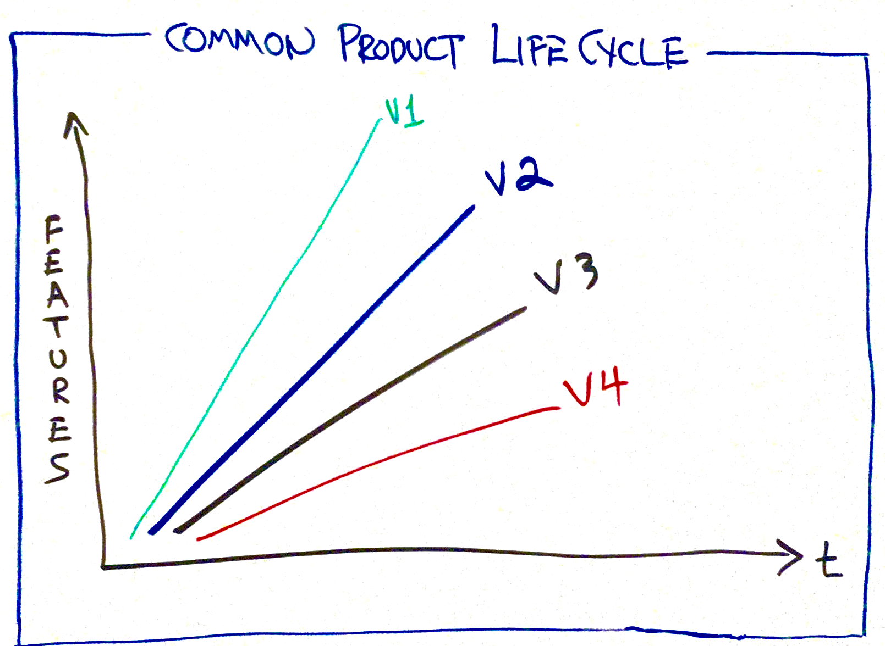

^How many of you have experienced this?
^What state does your code look like?
^$42B rewrite cancelled
^Often the code is just a mess

---

> ... haphazardly structured, sprawling, sloppy, duct-tape and bailing wire, spaghetti code jungle
-- Brian Foote & Joseph Yoder

---

> I'm never in favor of writing code poorly
-- Ward Cunningham

^ Technical Debt is the accumulated distance between our understanding of the domain and the understanding that the system reflects.

^ fist to five

^ Fred Brooks => accidental complexity

^ Perhaps Fred Brooks would have deemed this to be accidental complexity

^ this is often what people mean by TD

---

> Technical debt is the refactoring effort needed to add a feature non-invasively.
-- Michael Feathers

^ Sandi Metz - make the change easy ... and then make the easy change

---

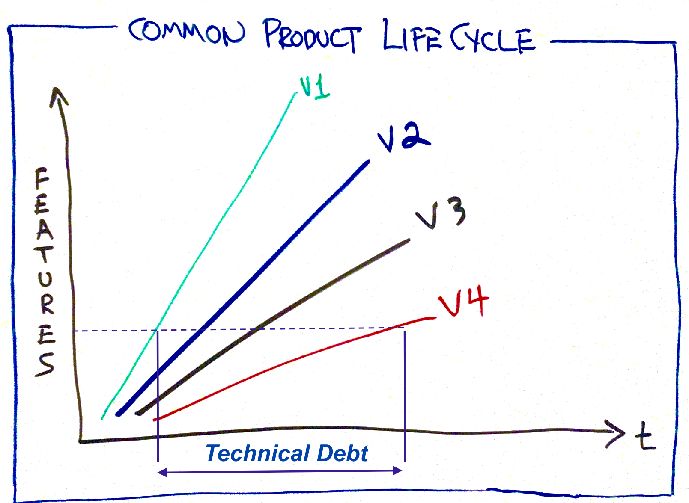

^Ok, how big is that cost in IT?

---

>Estimated at $500B with the potential to double every 5 years
-- Gartner report 2010

^ How big a problem is technical debt in your code?
^ ~ $3T worldwide IT spend
^ Why would that matter to me or my company?
^ Insuffiencient attention to technical practices

---

# The Alignment Trap

>..the path to IT-powered growth lies first in building high effectiveness and _**only then**_ ensuring that IT projects are highly aligned to the business.
--David Shpilberg, Steve Berez, Rudy Puryear, Sachin Shah

_MIT Sloan Review, Fall 2007_

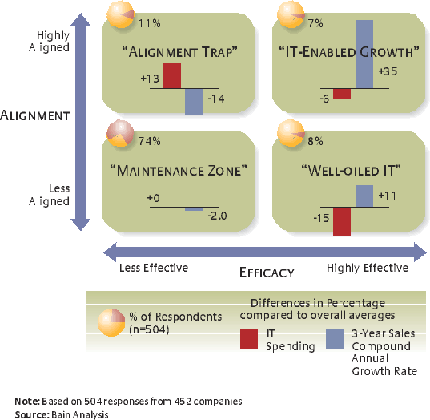

^ IT effective is a precursor to high alignment
^ Easier to move from highly effective to aligned that vice-versa

---

> Technical debt is the temptation built into software innovation.
-- Tom Grant

^ Adam wants the apple but is torn with 
---

# Brain battles itself over short-term rewards, long-term goals

> Study by Jonathan Cohen, Samuel McClure, David Laibson, George Loewenstein
-- Oct. 15 2004, Science

---

# Brain battles itself over short-term rewards, long-term goals

Would you prefer to receive $10 today or $11 tomorrow?

What about $10 in one year or $11 in a year and a day?

^ The researchers examined a much-studied economic dilemma in which consumers behave impatiently today but prefer or plan to act patiently in the future.

---

# Why do we act irrationally?

Preference for short-term rewards results from the emotion related parts of the brain winning out over the abstract reasoning parts.

^ this pattern results from the competing influence of two brain systems ... and one of them kicks in as you get really proximate to the reward
^-- Samuel McClure

^ Source: https://www.princeton.edu/pr/news/04/q4/1014-brain.htm

^ The study showed that decisions involving the possibility of immediate reward activated parts of the brain influenced heavily by neural systems associated with emotion. In contrast, all the decisions the students made -- whether short- or long-term -- activated brain systems that are associated with abstract reasoning.

^ The researchers concluded that impulsive choices or preferences for short-term rewards result from the emotion-related parts of the brain winning out over the abstract-reasoning parts. "There are two different brain systems, and one of them kicks in as you get really proximate to the reward," McClure said.

^ "Our emotional brain has a hard time imagining the future, even though our logical brain clearly sees the future consequences of our current actions," Laibson said. "Our emotional brain wants to max out the credit card, order dessert and smoke a cigarette. Our logical brain knows we should save for retirement, go for a jog and quit smoking. To understand why we feel internally conflicted, it will help to know how myopic and forward-looking brain systems value rewards and how these systems talk to one another."

^Oct. 14, 2004

---

> _Thinking, fast and slow_
--Daniel Kahneman

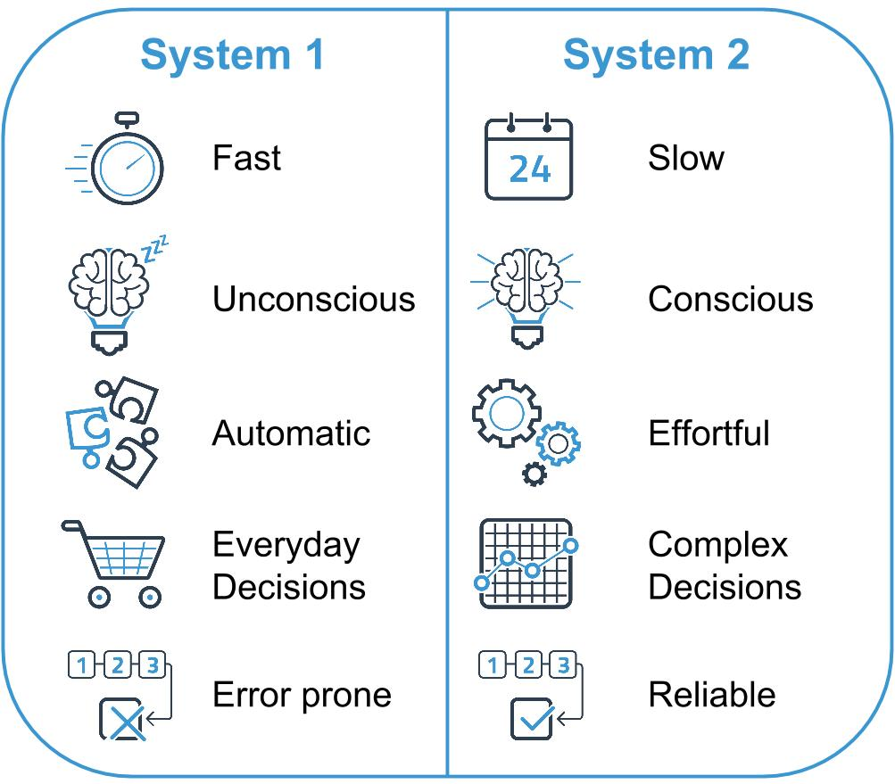

^System 1 operates automatically and quickly, with little or no effort and no sense of voluntary control.

^System 2 allocates attention to the effortful mental activities that demand ... and are often associated with the subjective experience of agency, choice, and concentration.

^The highly diverse operations of System 2 have one feature in common: they require attention and are disrupted when attention is drawn away.

---

# Systems thinking ... archetypes

Adapted from:

**_The Fifth Discipline_**
  - Peter M. Senge

**_The Fifth Discipline Workbook_**
  - Peter Senge, Richard Ross, Bryan Smith, Charlotte Roberts, Art Kleiner

^flight

---

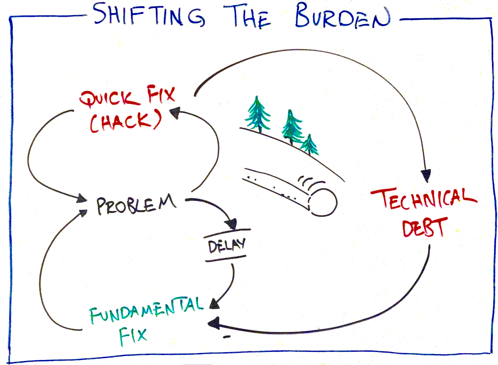

^ The delay may result in system 1 vs system 2 kicking in

---

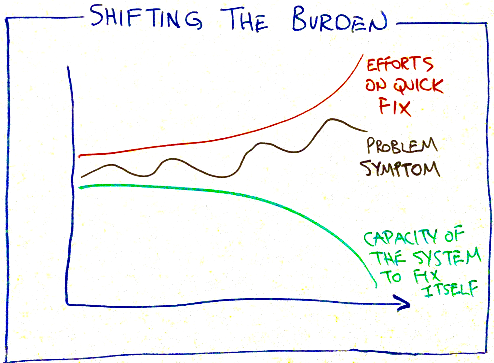

---

# Shifting the burden

**Contributing factors**

* heroics => creates an "addiction" loop
* shift to intervenors => consultants/vendors/internal experts

**Strategies**

* Articulate long-term goals
* Explore alternative solutions (e.g. rule of three)
* Make technical debt/health measures visible

---

# How can we make better decisions?

> ... unless you can develop some short-term incentives to get people to think about a long-term issue ... it’s going to be very hard for them to take measures today. 
-- Howard Kunreuther and Elke Weber

---

# Systemic negative health factors

| Factor |
|---|
| Budgeting |
| Hiring "resources" |
| Overt project focus |
| Skills & attitudes |
| Lack of visibility |

---

# Shifting the system

Move from ... |  and shift to ...
---|---
Budgeting | Strategic investments
Hiring "resources" | Stable teams, dynamic teaming
Overt project focus | Customer and product focus
Skills & attitudes | Training, pairing, mobbing
Lack of visibility | Measure and communicate health

^ XP skills

---

# Let's measure ... simply

Ask the team "How do we feel about the quality of our code?"

* 1 => “a debt-riddled pile of crap”
* 5 => “clean, awesome code with 0 technical debt”

_From Henrik Kniberg and used with permission_

---

## Set a **_baseline_** that we strive for (say 4.5)

## Set a "we gotta fix this" **_ceiling_** (say 3)

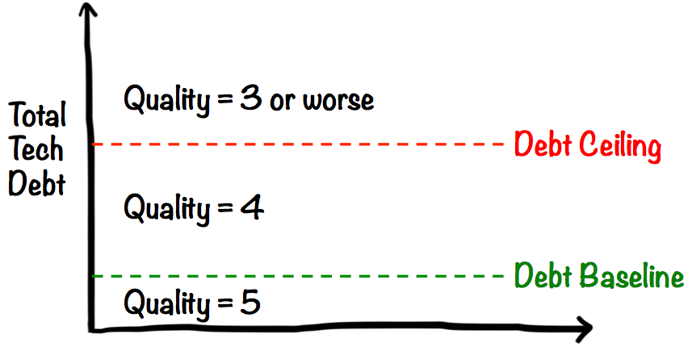

^ I like that we now have a positive target

---

## We immediately remove technical debt.

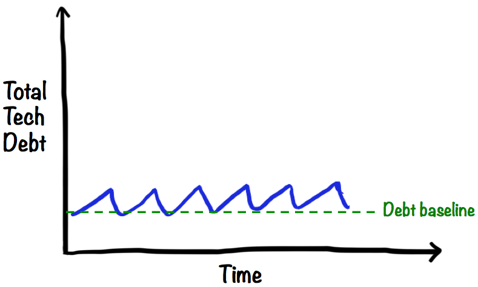

---

## It can be hard to see and/or address all the debt 100% of the time ... so...

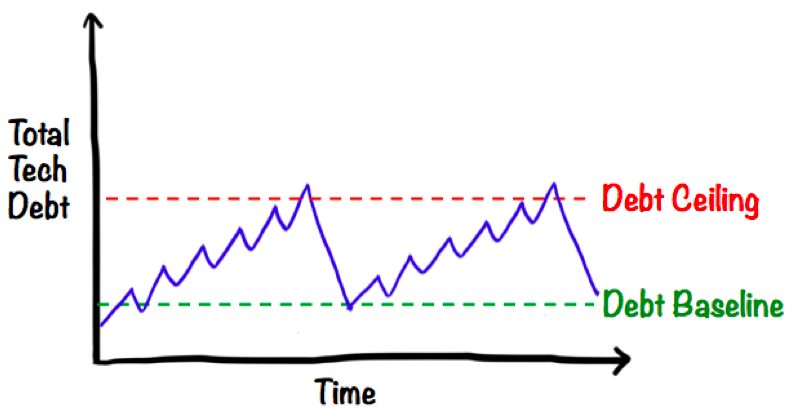

---

## We can use tech debt stories or iterations to cleanup

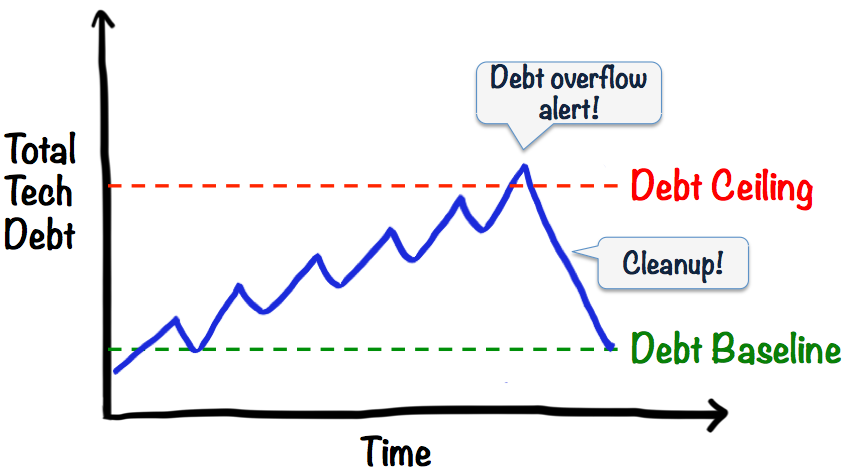

---

# Technical debt metaphor

* Powerful
* Primarily measures "crap"
* Can be over-extended
* Only impacts you when you change the code
* _"We go into debt all the time ... what's the problem?"_

^ Can be attributed to real costs

---

# Technical health

### Building software well is like living a healthy life.

### We are able to perform well day to day, avoid illness, and perform at a high level when the situation demands it.

^ Simplistically, just the opposite of debt
^ Implies a personal "lifestyle" change
^ Applies to individuals and teams
^ Measures can simply be inverted

^ People could be more motivated to improve something positive, rather then decrease something negative

---

# Wrapping up ...

* Frame a strategy => communicate it
* Look for systemic issues => align with strategy
* Measure technical health => make it visible
* Work together => pairing, mobbing
* Build technique => training, deliberate practice
* Create positive addiction loops => e.g. TDD, ATDD
* Reframe technical debt => technical health

---

# May you technically ...
#
# _**live long and prosper**_

---

# References

* [https://www.agilealliance.org/resources/initiatives/technical-debt/](https://www.agilealliance.org/resources/initiatives/technical-debt/)
* [https://www.princeton.edu/pr/news/04/q4/1014-brain.htm](https://www.princeton.edu/pr/news/04/q4/1014-brain.htm)
* [http://bigthink.com/errors-we-live-by/kahnemans-mind-clarifying-biases] (http://bigthink.com/errors-we-live-by/kahnemans-mind-clarifying-biases)
* [http://www.gartner.com/newsroom/id/1439513](http://www.gartner.com/newsroom/id/1439513)
* [http://blog.crisp.se/2013/10/11/henrikkniberg/good-and-bad-technical-debt](http://blog.crisp.se/2013/10/11/henrikkniberg/good-and-bad-technical-debt)

---

# References

* [http://upfrontanalytics.com/market-research-system-1-vs-system-2-decision-making/](http://upfrontanalytics.com/market-research-system-1-vs-system-2-decision-making/)
* [http://www.nber.org/papers/w19776](http://www.nber.org/papers/w19776)
* [http://knowledge.wharton.upenn.edu/article/the-key-to-making-smarter-long-term-decisions/](http://knowledge.wharton.upenn.edu/article/the-key-to-making-smarter-long-term-decisions/)
* [The Fifth Discipline](https://www.amazon.com/Fifth-Discipline-Practice-Learning-Organization/dp/0385517254)
* [The Fifth Discipline Fieldbook](https://www.amazon.com/Fifth-Discipline-Fieldbook-Strategies-Organization/dp/0385472560/ref=pd_lpo_sbs_14_img_1?_encoding=UTF8&psc=1&refRID=0QN8M0PTWCXCJ906ZBG1)
* [http://ward.bay.wiki.org/view/hard-to-see](http://ward.bay.wiki.org/view/hard-to-see)

---
# References

* [http://www.ebizq.net/blogs/agile_enterprise/2009/11/dont-fall-in-the-alignment-trap.php](http://www.ebizq.net/blogs/agile_enterprise/2009/11/dont-fall-in-the-alignment-trap.php)
* [http://sloanreview.mit.edu/article/avoiding-the-alignment-trap-in-it/](http://sloanreview.mit.edu/article/avoiding-the-alignment-trap-in-it/)

<!--
---

---

---

# Fixes that backfire

**Contributing factors**

* tbd

**Strategies**

* tbd

-->
