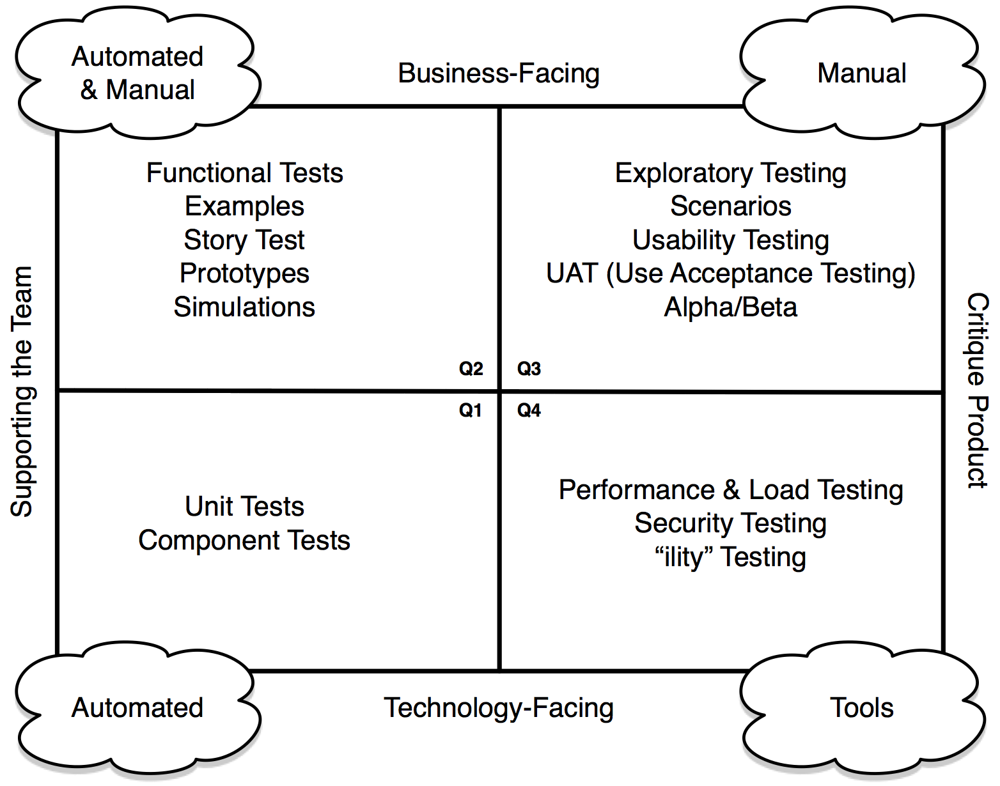

# Agile Testing

### Testing Quadrants

To help bring clarit to the complicated subject  of testing Brian Merrick created the "Testing Quadrants."
He has separated types of testing into four domains, as in the diagram below.

Tests on the left <em>support the team</em> during development. They are used to help drive development of the product.

Tests on the right <em>critique the product</em>. They are used to verify that the product meets, and continues to meet, the requirements.

Tests on the top are <em>business facing</em>. Business can understand them, and should be interested in them.

Tests on the bottom are <em>product facing</em>. They test the product, but might not be interesting for non-technical business folks.

#### Bottom-Left - Technology-Facing Supporting Development

This is the domain of automated unit and componant tests. Your business is probably not interested in seeing these tests (although they would love to have the confidence of knowing you are writing them). They support the team because they allow the team to quickly evolve and new features to the code.
In particular Test-Driven Development (TDD) is in this quadrant. Writing code using TDD helps you think through the requirements in an incremental fashion, and having the TDD tests allows to you refactor continously to keep your code clean to allow you to move fast.

#### Top-Left - Biz Facing Supporting Development

These tests help you to clarify your understanding of the product with business. Processes like Acceptance-Test-Driven-Development (ATDD) use the clarity that comes from writing tests together to ensure that there is alignment between business and developers. As an added bonus you create an automated regression suite.

