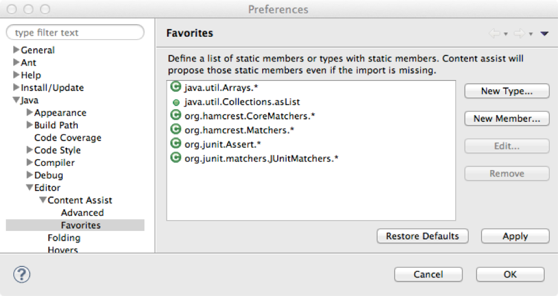

# Set up Eclipse favourites

Configuring favourites allow you to have content assist for static methods and classes even if you have not imported them into the current class.

* open the `Preferences` dialog and select `Java` | `Editor` | `Content Assist` | `Favorites` in the left navigation pane
* select `New Member ...`
  * enter `java.util.Collections.asList`
* for each of the types in the table below:
  * select `New Type ...`
  * enter the `Type` listed below
  * press `OK`

| Type                            |
| :---                            |
| java.util.Arrays |
| org.hamcrest.CoreMatchers |
| org.hamcrest.Matchers |
| org.junit.Assert |
| org.junit.matchers.JUnitMatchers |

When you are done the favourites should look something like:

