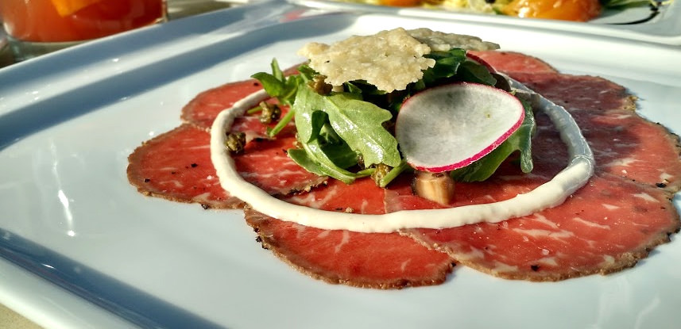

# Elephant Carpaccio Exercise
(from http://alistair.cockburn.us/Elephant+Carpaccio+exercise)

### Instructions

1. Break into teams of 2-3 people.

2. Preparation - Each team writes down on sticky notes the 10-20 demo-able user stories ("slices") they will develop and possibly demo. Each should be doable in 3-8 minutes. No slice is just mockup of UI, creation of a data table or data structure. All demos show real input & output (not test harness).

3. Discussion - Instructor/facilitator leads discussion of the slices, what is and isn't acceptable, solicits ways to slice finer.

4. Development - A fixed time-box of 40 minutes, five 8-minute development sprints, clock does not stop. At the end of each sprint, each team shows its product to another team.

5.	Debrief

####Discount Calculation
|Order Value | Discount Rate|
| :---: | :---: |
|$1,000|3%|
|$5,000|5%|
|$7,000|7%|
|$10,000|10%|
|$50,000|15%|

####Tax Calculation
|State | Tax Rate|
| :---: | :---: |
|UT|6.85%|
|NV|8.00%|
|TX|6.25%|
|AL|4.00%|
|CA|8.25%|
