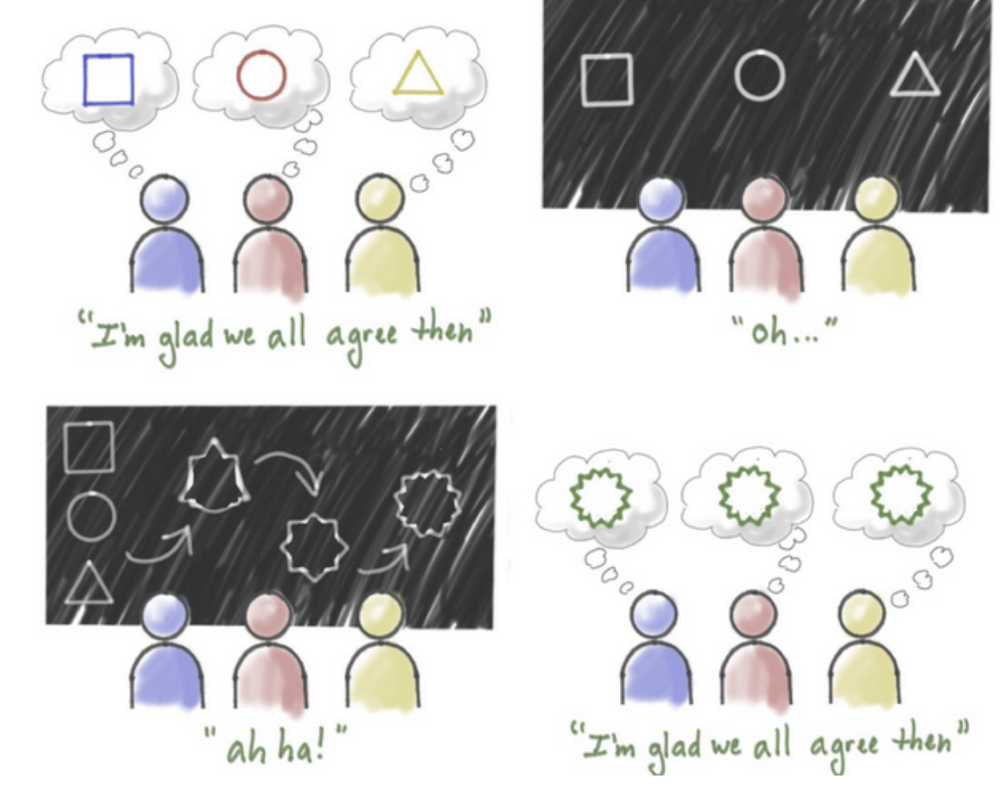

# Specification By Example

To build the right product effectively, software development practices have to provide the following:

* Assurance that all stakeholders and delivery team members understand what needs to be delivered in the same way.
* Precise specifications so delivery teams avoid wasteful rework caused by ambiguities and functional gaps.
* An objective means to measure when a piece of work is complete.
* Documentation to facilitate change, in terms of both software features and team structure.

Specification By Example provides a solution that:

* Avoids wasteful over-specifying; avoid spending time on details that will change before a piece of work is developed.
* Has reliable documentation that explains what the system does so we can change it easily.
* Efficiently checks that a system does what the specifications say.
* Keeps documentation relevant and reliable with minimal maintenance costs.
* Fits all this into short iterations and  flow-based processes, so that the information on upcoming work is produced just-in-time.

Specifying collaboratively enables the team to harness the knowledge and experience of the whole team. It also creates a collective ownership of specifications, making everyone more engaged in the delivery process. The team works with the business users to identify key examples that describe the expected functionality. During this process, developers and testers often suggest additional examples that illustrate edge cases or address areas of the system that are particularly problematic. This  flushes out functional gaps and inconsistencies and ensures that everyone involved has a shared understanding of what needs to be delivered, avoiding rework that results from misinterpretation and translation.

*Three Amigos* is a popular way of conducting Specification by Example workshops that involve one developer, one tester, and one business analyst. The purpose of these workshops is to create semiformal tests collaboratively which ensures that the information won’t get distorted during automation later on. It also helps to share knowledge about how to write good specifications with examples.