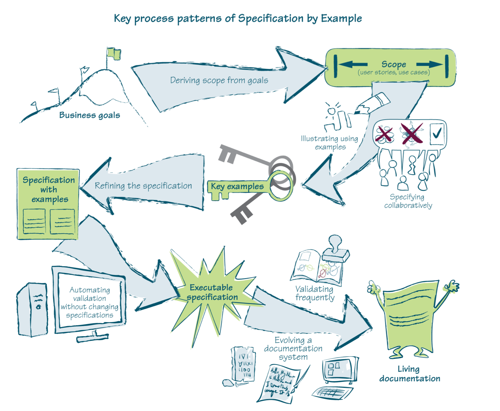

# Specification By Example

To build the right product effectively, software development practices have to provide the following:

* Assurance that all stakeholders and delivery team members understand what needs to be delivered in the same way.
* Precise specifications so delivery teams avoid wasteful rework caused by ambiguities and functional gaps.
* An objective means to measure when a piece of work is complete.
* Documentation to facilitate change, in terms of both software features and team structure.

Specification By Example provides a solution that:

* Avoids wasteful over-specifying; avoid spending time on details that will change before a piece of work is developed.
* Has reliable documentation that explains what the system does so we can change it easily.
* Efficiently checks that a system does what the specifications say.
* Keeps documentation relevant and reliable with minimal maintenance costs.
* Fits all this into short iterations and  flow-based processes, so that the information on upcoming work is produced just-in-time.

