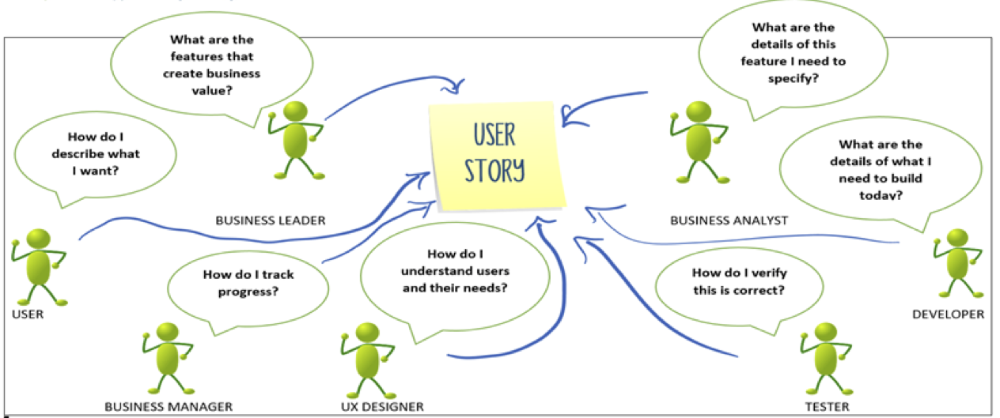
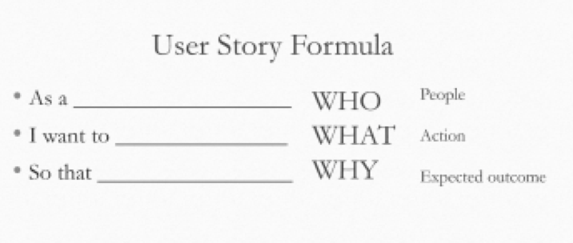

# Agile User Stories


### Purpose of a User Story

User requirements in Agile are called User Stories. Rather than spend months creating for a business requirements document (BRD) that lists all the things “the system shall” do, user stories represent things people want to do. Light on detail, they are designed to be placeholders for conversations.

User stories act as a focal point to facilitate conversation between many people.


### 3 Cs of a User Story

User stories have three critical aspects (from Ron Jeffries):

#####Card
Stories are written on cards. Limiting to the size of the card is purposeful. It makes sure that the story does not contain all the information, but just enough to identify the story. They are placeholders for the second aspect: conversation.  
Cards are used and displayed during planning and on the Scrum or kanban board. 

#####Conversation
The requirements on each card are communicated from the customer to the team through conversation: exchange of thoughts, opinions, and feelings. These conversations happen many times while the card is in play: during release planning, iteration planning, and again when the story is ready for implementation. 
The conversation is largely verbal, but can be supplemented with documents (such as acceptance criteria). The best supplements are written in the form of tests and examples, which provide the next aspect: confirmation that we are done. 

##### Confirmation
It is important that we all agree about what we should have when we are done the story. The third C is confirmation. This component is the acceptance criteria.
At the beginning of the iteration, the customer communicates to the team what she wants, by telling them how she will confirm that they’ve done what is needed. This allows us to show that the story has been implemented correctly.
Many teams express the criteria in the form of tests, which ensures clarity (and as a bonus makes it easy to create some automated tests!). 
After running an acceptance test (manual or automated) and confirming with the client that the test was successful a card has been completed.


### User Story Format

The user story format is designed to ensure you capture the three most important aspects of a story. Who it is for, what they want to do, and why they want to do it.



## Questions

something?

```


```
