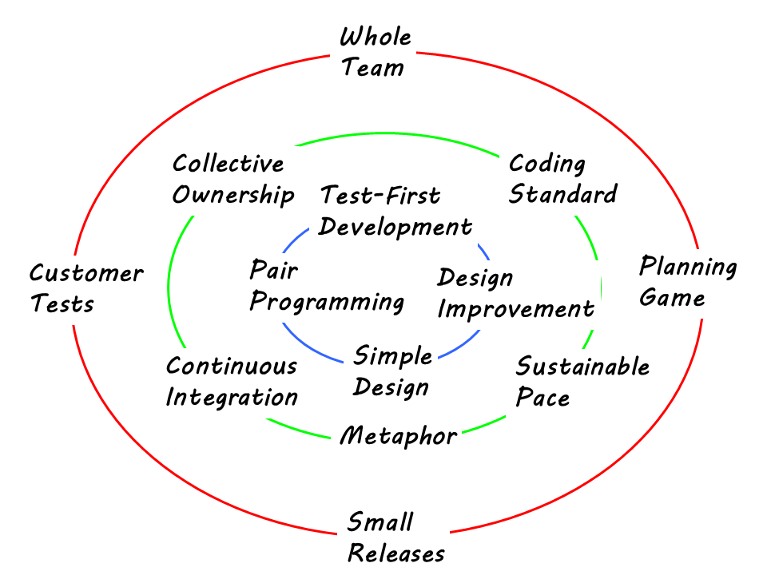

# Extreme Programming

Extreme programming (XP) is a software development methodology which is intended to improve software quality and responsiveness to changing customer requirements. It was invented in the late 90s by Kent Beck (and others).

It is similar to Scrum, and has largely been displaced by it as a development methodology.

XP differs from Scrum in that is prescribes specific programming practices. Test-Driven Development (TDD), Pair Programming, Simple Design, Continous Design Improvement (Refactoring) and Continuous Integration are all parts of the XP methodology.

Scrum chooses not to include specific practices (which probably has helped it's adoption), but Scrum teams quickly discover that they will not be successful without paying attention to practices. XP practices are mandated as part of other methodologies, such as Scaled Agile Framework (SAFe).

