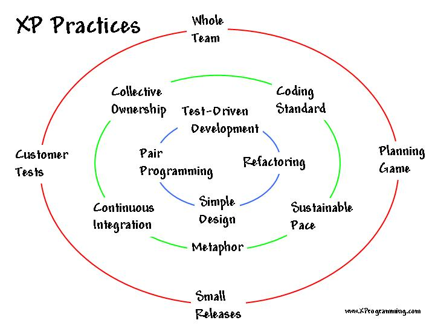

# Extreme Programming

Source: http://ronjeffries.com/xprog/what-is-extreme-programming/circles.jpg

### History of XP
Extreme programming (XP) is a software development methodology which is intended to improve software quality and responsiveness to changing customer requirements. It was invented in the late 90s by Kent Beck (and others).

It is similar to Scrum, and has largely been displaced by it as a development methodology.

### XP Practices
XP differs from Scrum in that prescribes specific development practices. Test-Driven Development (TDD), Pair Programming, Simple Design, Refactoring and Continuous Integration are all parts of the XP methodology.

Scrum chooses not to include specific practices (which probably has helped its adoption), but Scrum teams quickly discover that they will not be successful without paying attention to technical practices. XP practices are mandated as part of other methodologies, such as Scaled Agile Framework (SAFe).

### XP / Devops / Continuous Delivery
Although Extreme Programming is not frequently practiced, the practices live on! We consider The Continuous Delivery and Devops movements to be built on the evolution of XP practices. Frequent integration of developers' work has evolved to frequent delivery right to customers! This has necessitated even more attention to XP practices such as keeping your code and design clean, automated testing at every level, and frequent customer interaction.
